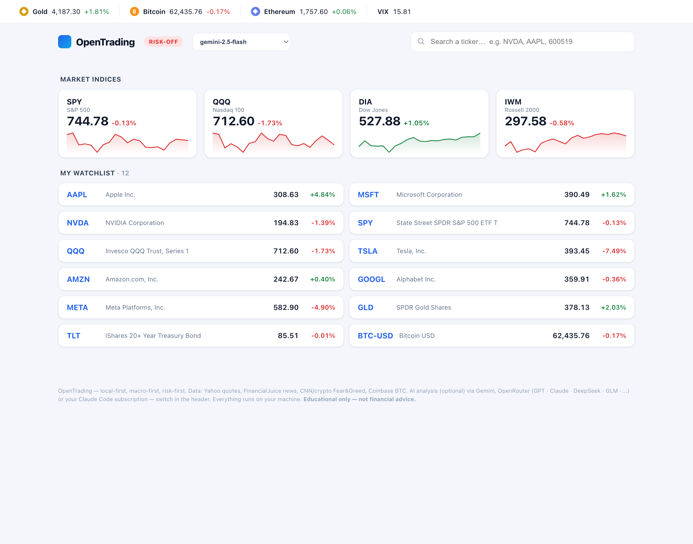
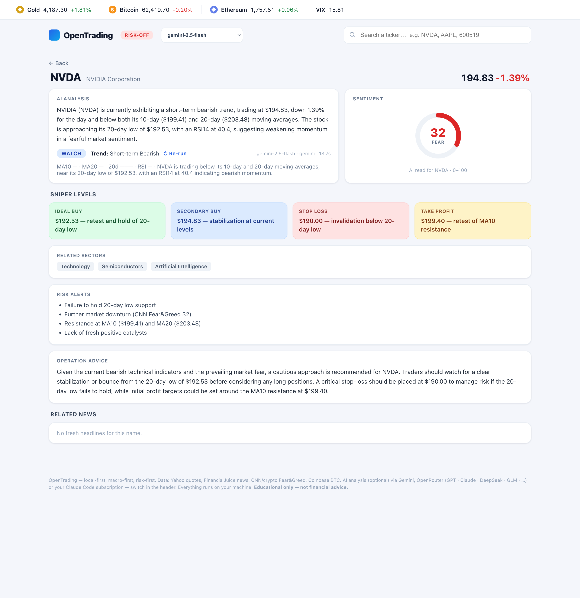

# OpenTrading

**A local-first trading copilot for Claude Code — macro-first, risk-first, zero API keys.**

[](LICENSE)
[](#requirements)
[](#requirements)
[](#ask-claude)

**English** | [简体中文](README.zh-CN.md)

**[Preview](#product-preview) · [Quickstart](#quickstart) · [Features](#what-you-get) · [Web dashboard](#ot-web--the-local-dashboard) · [Daily email](#daily-pre-market-email) · [Privacy](#privacy)**

OpenTrading fuses **macro, news, smart-money positioning, and options gamma** into one
opinionated read — then turns it into a concrete **CALL / PUT / NO-ACTION** through a
decision engine that follows a learned, risk-first policy. Everything runs on your
machine: no SaaS, no keys, no data leaving your laptop. It's the **open alternative to
closed alpha-simulation platforms** — pair the trading *skill* (the expertise) with small,
dependency-free *data CLIs* (the live data), and let Claude drive both.

> ⚠️ **Educational only — not financial advice.** Trading carries substantial risk of loss.

---

## Product preview

**`ot web` — a local, keyless dashboard** over the same data stack: live ticker strip,
index cards with sparklines, your watchlist — and one-click AI analysis on
**switchable engines** (pick Gemini, any OpenRouter model, or your Claude Code
subscription straight from the header):

<p align="center"></p>

**Per-ticker AI analysis** — action chip, sentiment gauge, **sniper levels**
(ideal buy · secondary buy · stop · target), risk alerts, operation advice — with
the engine and latency stamped on every run (`gemini-2.5-flash · 13.7s`):

<p align="center"></p>

**The daily pre-market email** — position-aware, Claude-written, Outlook-safe HTML:
regime call, your book with levels, a graded **Top-3 watchlist** (Enter / Wait at an
exact price), hedge plan, and the event gate:

<p align="center"></p>

<sub>All screenshots use a fictional demo book — your real positions never leave your machine.</sub>

---

## Quickstart

```bash
git clone https://github.com/orangejustin/OpenTrading
cd OpenTrading
bash install.sh        # puts `ot` on PATH + a health check — no keys, nothing to compile
```

Everything is **one command, `ot`**:

```bash
ot                     # the morning read: macro + news + smart money + options + your book
ot news --window premarket   # live FinancialJuice headlines (public RSS — no account)
ot macro               # scored intraday macro dashboard (SOFR / 2s10s / TGA / RRP)
ot options SPY --dte 7 # put/call + dealer gamma (GEX) + gamma walls
ot decide QQQ --dte 0  # one concrete call: CALL / PUT / NO-ACTION + conviction + size
ot help                # every subcommand
```

> Don't want to touch your PATH? Skip `install.sh` and run in place: `bin/ot …`

**New here?** Start with the three [hero workflows](WORKFLOWS.md) — *morning read*, *is it
safe to size up?*, and *grade my book* — each is one command plus one prompt to Claude.

---

## Why it's different

- **Local & keyless.** Every core tool runs on public, no-auth endpoints (or a `curl`
  fallback). Nothing to sign up for, nothing phoning home.
- **Opinionated, not a data dump.** It doesn't just fetch — it *scores* macro, flags
  sentiment/credit divergences, reads dealer gamma, and gives a per-position game plan.
- **A policy, not vibes.** `ot decide` encodes a written, risk-first strategy
  (selection > timing, 0DTE done right, a hard daily-loss stop) — auditable in the repo.
- **Claude-native.** An embedded skill activates on any trading question and pulls live
  data through `ot` for you. Open it in Claude Code and just ask.
- **Bring-your-own-AI.** The AI layer is optional and engine-agnostic: a free Gemini key,
  one OpenRouter key for *any* model (GLM · DeepSeek · GPT · Claude · Grok …), or your
  existing **Claude Code subscription with no key at all** — switchable per request.
- **Private by design.** Your positions and secrets are git-ignored and never shippable
  (see [Privacy](#privacy)).

---

## What you get

| Piece | Command | What it does |
|-------|---------|--------------|
| **Market report** | `ot` | Fuses macro + news + smart money + options + your book → one regime read |
| **Deep report** | `ot report --deep` | Splits the pack into parallel analyst desks + a synthesis pass (multi-agent prototype) |
| **News** | `ot news` | FinancialJuice squawk (public RSS) — windowed, ticker-filtered, storable |
| **Macro** | `ot macro` | SOFR / 2s10s / TGA / RRP → scored put/call bias |
| **Smart money** | `ot smart` | CNN + crypto Fear&Greed, BTC funding (contrarian) |
| **Options** | `ot options` | Put/Call + dealer gamma (GEX) + gamma walls (CBOE) |
| **Event gate** | `ot catalysts` / `ot earnings` | FOMC/CPI/PCE/NFP/OPEX + per-name earnings → size-up verdict |
| **Quotes** | `ot quote` | No-key quotes incl premarket + `^VIX`; `ot cn` for China A-shares |
| **Decision engine** | `ot decide` | CALL / PUT / NO-ACTION + conviction + size, from the learned policy |
| **Daily email** | `ot email` / `ot schedule` | Position-aware, Outlook-safe HTML pre-market brief via SMTP |
| **Web dashboard** | `ot web` | Local dashboard: indices + watchlist + per-ticker AI analysis on switchable engines |

Add `--json` to any tool for machine-readable output. Full help: `ot help`.

---

## Ask Claude

Open the folder in **Claude Code** (or Claude Desktop) and just ask — the embedded
**short-term-trader** skill activates automatically and pulls live data through `ot`:

- *"Give me my morning macro brief — calls or puts on QQQ today?"*
- *"Any FinancialJuice news on NVDA in the last hour? Store it."*
- *"NVDA broke $950 on volume, RSI 62, account $30k — how do I trade it?"*

The skill enforces the house rules on every answer: **macro first → setup second → size
third**, **risk before opportunity**, **news only matters in context**, and an
educational-not-advice disclaimer. Its eight workflows cover macro bias, news-impact,
trade setups, options, crypto sizing, the P&L journal, backtesting, and portfolio review.

---

## Daily pre-market email

A **position-aware** pre-market brief in your inbox every weekday — the same fusion as
`ot`, written up by Claude and delivered as styled, **Outlook-safe HTML** (plain-text
fallback). Each run fuses macro bias, smart-money sentiment, options gamma, last-24h news
tied to *your* names, a $-weighted book table, and the day's event gate.

```bash
cp .env.example .env       # set OT_SMTP_* + OT_EMAIL_TO  (Resend works with no 2FA)
ot email --dry-run         # confirm config (no send)
ot email                   # one-off send   ·   --lang zh for 简体中文
ot schedule email          # weekdays 08:30 local (macOS launchd) · `… email uninstall` to remove
```

> macOS: launchd can't read repos under `~/Desktop`, `~/Documents`, or `~/Downloads` (TCC)
> — keep the repo elsewhere (e.g. `~/OpenTrading`). Details: [`tools/email/README.md`](tools/email/README.md).

---

## `ot web` — the local dashboard

The same data stack as a clean local web app — stdlib `http.server`, vanilla JS,
no build step, bound to `127.0.0.1` (see the [preview](#product-preview) above):

```bash
ot web                                          # http://127.0.0.1:8787
ot web --engine claude                          # boot on the no-key Claude Code engine
ot web --engine openrouter --model z-ai/glm-5.2 # boot on GLM 5.2
```

The data panels are **keyless**; the per-ticker AI analysis runs on your choice of
engine, switchable live from the header:

| Engine | Key | Models |
|---|---|---|
| **Gemini** | `GEMINI_API_KEY` (free tier) | gemini-2.5-flash / -pro |
| **OpenRouter** | `OPENROUTER_API_KEY` — one key, any model | GLM 5.2 · DeepSeek v4 · GPT-5.5 · Claude · Grok · any slug |
| **Claude Code** | **none** — your existing subscription | headless `claude -p` (default / sonnet / opus / haiku) |

Deep links (`/#NVDA`), a 10-minute per-(ticker, engine, model) cache, and a ↻ Re-run
button. Details: [`tools/web/README.md`](tools/web/README.md).

---

## `ot decide` — the policy in one call

`ot decide TICKER --dte N` turns the skill's written policy into a single concrete call —
**CALL / PUT / NO-ACTION** + conviction + size — from no-key data (price/gap/trend + `^VIX`):

```bash
ot decide QQQ  --dte 0     # 0DTE: fade-gap + VIX-confirm + skip-events + selectivity
ot decide NVDA --dte 5     # swing: momentum calls on names you read well
```

It encodes [`references/learned-strategy.md`](.claude/skills/short-term-trader/references/learned-strategy.md)
(selection > timing; a hard daily-loss stop; never size up after a loss) and points you at
`ot options` / `ot news` / `ot macro` for the IV / gamma-wall / news confirmation it can't
see. **NO-ACTION is a position.**

---

## Privacy

Your holdings and secrets **never** enter git and are **never** part of any release:

| What | Lives in | Status |
|------|----------|--------|
| Your positions | `watchlist.json` | **git-ignored** — only `watchlist.example.json` is tracked |
| Email / API credentials | `.env` | **git-ignored** — only `.env.example` is tracked |
| Fetched news, reports, briefs | `data/` | **git-ignored** |

```bash
cp watchlist.example.json watchlist.json   # then edit with YOUR positions
cp .env.example .env                        # then add your SMTP creds
```

The `*.example` files are placeholders; the real ones stay on your machine. That
separation is what makes the repo safe to share. **Never commit `.env` or `watchlist.json`.**

---

## Optional power modules

The core above is the **plain tier**: free, keyless, zero manual steps. These add more but
are **optional** and need manual setup — nothing in the core depends on them.

- **TradingView (shipped)** — bridge your TradingView Desktop app to Claude via the
  [`tradingview-mcp`](https://github.com/tradesdontlie/tradingview-mcp) server, then ask
  *"analyze MSTR with the TV data"* and it reads live quotes / study values / your Pine
  levels off your chart. *(ToS-gray; runs against your own logged-in client.)*
- **IBKR (planned, `tools/ibkr/`)** — Interactive Brokers via
  [`ib_async`](https://github.com/ib-api-reloaded/ib_async): live quotes, option chains,
  positions, and **paper** execution behind an explicit guard. Never auto-submits live orders.

---

## Roadmap

Where it's headed (shipped history in [`RELEASE_NOTES.md`](RELEASE_NOTES.md); detail in [`ROADMAP.md`](ROADMAP.md)):

- **Web dashboard v2.** (v1 shipped: `ot web`.) Price charts in the analysis view, the
  event calendar as cards, sector aggregation, and a personalized strategy lab.
- **Multi-engine debate.** The three AI engines argue a ticker — one bull, one bear,
  one judge (assigned stances, 5-tier verdict) — distilling
  [TradingAgents](https://github.com/TauricResearch/TradingAgents)' debate protocol
  into three keyless-friendly LLM calls.
- **Personalized simulation.** A transparent, local strategy simulator that tunes the
  decision policy to *your* trading — open, auditable, on your own machine.
- **Multi-agent research desk.** Claude/Codex as the mastermind: specialist agents
  (macro, news, options, risk) run in parallel and a synthesis pass fuses them — more
  coverage, fewer tokens. Learning from [TradingAgents](https://github.com/TauricResearch/TradingAgents).
- **Email v2 — user-tunable feeds.** Pick which sources the daily brief fuses, opt-in per source.
- **More no-key data** — FRED, options IV/IVR, funding curves.

---

## Requirements

Python 3.9+ (standard library only; uses `certifi` if installed, else falls back to system
`curl`). No keys, no paid feeds. For a reproducible dev environment, `ot` auto-prefers
[`uv`](https://github.com/astral-sh/uv) when installed (`uv sync` for locked deps) and
otherwise runs on plain `python3` — override with `OT_PYTHON`, disable uv with `OT_NO_UV=1`,
inspect with `ot doctor`.

---

## Credits & disclaimer

Built by [@orangejustin](https://github.com/orangejustin). The multi-agent direction draws
inspiration from [TradingAgents](https://github.com/TauricResearch/TradingAgents).

Analysis is for **educational purposes only** — **not financial advice**. Markets are
risky; size accordingly and do your own research.
