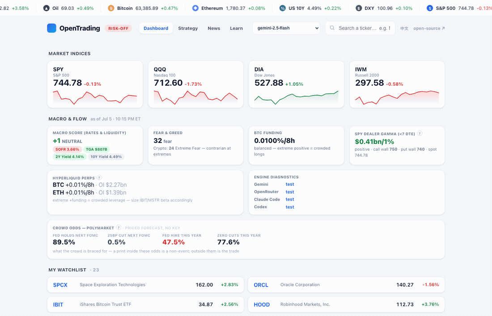
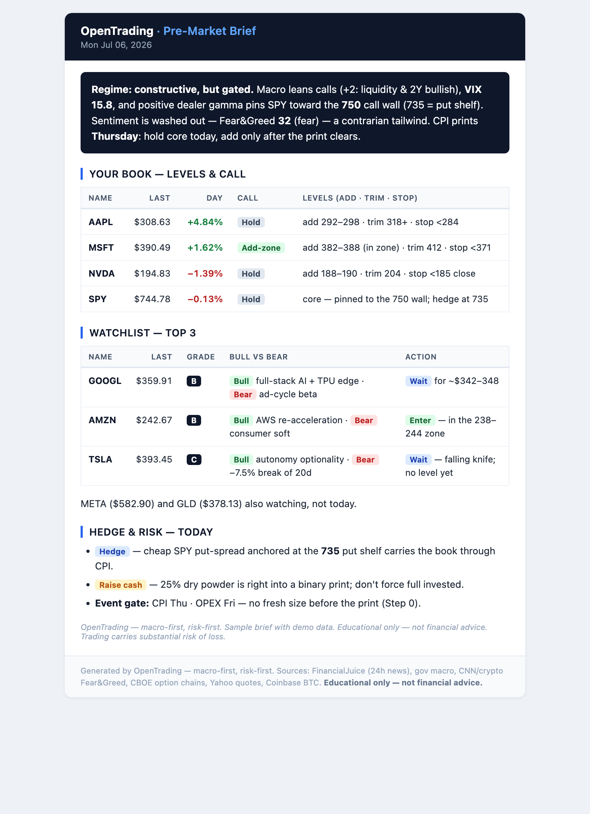

<div align="center">


<h1>OpenTrading</h1>

**A local-first trading copilot — macro-first, risk-first, zero API keys.**

📖 **[Documentation & tutorial site →](docs-site/)** &nbsp;·&nbsp; built with Docusaurus, deploy free to Vercel / Cloudflare Pages / GitHub Pages

[](LICENSE)
[](#requirements)
[](#requirements)
[](#requirements)
[](#ask-claude)

**[Preview](#preview) · [First principles](#first-principles) · [Features](#what-you-get) · [Quickstart](#quickstart) · [Web dashboard](#ot-web--the-local-dashboard) · [Daily email](#daily-pre-market-email) · [Privacy](#privacy)**

**English** | [简体中文](README.zh-CN.md)

</div>

OpenTrading fuses **macro, news, smart-money positioning, and options gamma** into one
opinionated read — then turns it into concrete action: a graded **Long / Short / Wait**
board, sniper levels, and a **CALL / PUT / NO-ACTION** decision engine that follows a
learned, risk-first policy. Everything runs on your machine: no SaaS, no keys, no data
leaving your laptop. Pair the trading *skill* (the expertise) with small, dependency-free
*data CLIs* (the live data), and let Claude drive both.

> ⚠️ **Educational only — not financial advice.** Trading carries substantial risk of loss.

---

## Preview

<p align="center"></p>
<p align="center"><sub>≈12s tour of <code>ot web</code>: dashboard with Macro&nbsp;&amp;&nbsp;Flow → the Strategy action board → News + event gate → a ticker page (instant keyless chart) → one-click AI analysis with sniper levels.</sub></p>

<table align="center"><tr>
<td align="center" width="50%"><br><sub><b>Strategy — the action board.</b> One deterministic <code>ot decide</code> read per name: Long/Short/Wait · A–D grade · buy/add/trim zones · stop. No LLM, ~1s.</sub></td>
<td align="center" width="50%"><br><sub><b>The daily pre-market email.</b> Position-aware, Claude-written, Outlook-safe HTML: regime call, book levels, graded Top-3, hedge plan, event gate.</sub></td>
</tr></table>

<p align="center"><sub>All demos use a fictional book — your real positions never leave your machine.</sub></p>

---

## First principles

Three rules the whole system enforces, in order:

| # | Principle | What it means in the product |
|---|---|---|
| 1 | **Macro first, setup second, size third.** | Every read starts from rates/liquidity + dealer gamma + sentiment — a trade idea that fights the regime gets demoted, whatever the chart says. |
| 2 | **Risk before opportunity.** | No level without an invalidation: every plan carries a stop and a size derived *from* that stop; the event gate (FOMC/CPI/OPEX/earnings) can veto sizing entirely. **NO-ACTION is a position.** |
| 3 | **Local first, keyless first.** | Public no-auth endpoints, Python stdlib, everything on `127.0.0.1`. The AI layer is optional garnish — three interchangeable engines, one of which is your existing Claude subscription with no key at all. |

---

## What you get

| Piece | Command | What it does |
|-------|---------|--------------|
| **Market report** | `ot` | Fuses macro + news + smart money + options + your book → one regime read |
| **Web dashboard** | `ot web` | Local cockpit: tape · Macro & Flow · Strategy board · News + event gate · **prediction desk** per ticker · a **Learn** textbook · a **中文/EN** toggle |
| **Prediction desk** | `ot debate` / `ot rank` | Bull vs bear on different engines → a committed verdict; one composite score ranks your whole book |
| **Forecast cones** | `ot quant` / `ot forecast` | Keyless logistic P(up) + empirical cone; optional TimesFM foundation-model cone |
| **Decision engine** | `ot decide` | CALL / PUT / NO-ACTION + conviction + zones, from the learned policy |
| **Daily email** | `ot email` / `ot schedule` | Position-aware, Outlook-safe HTML pre-market brief via SMTP (EN or 中文) |
| **News** | `ot news` | FinancialJuice squawk (public RSS) — windowed, ticker-filtered, storable |
| **Macro & flow** | `ot macro` / `ot smart` / `ot poly` | Rates/liquidity bias · Fear&Greed · BTC funding · Polymarket crowd odds |
| **Options** | `ot options` | Put/Call + dealer gamma (GEX) + gamma walls (CBOE) |
| **Positioning** | `ot hl` / `ot whales` | Hyperliquid perp funding/OI · labeled-wallet ETH flows (keyless RPC) |
| **Event gate** | `ot catalysts` / `ot earnings` | FOMC/CPI/PCE/NFP/OPEX + per-name earnings → size-up verdict |
| **Quotes** | `ot quote` / `ot cn` / `ot cnpack` | No-key quotes incl. pre/post/**overnight** + `^VIX`; China A / HK · 涨停池 |
| **Data sanity** | `ot validate` / `ot privacy-audit` | Cross-source quote check (Yahoo × CBOE) · pre-push secret/branch gate |

Add `--json` to any tool for machine-readable output. Full help: `ot help`.

---

## The prediction desk

The flagship: a **personal short-term prediction desk** — an ensemble of independent
forecasters, fused by an LLM judge, scored by a learning loop. Deterministic SOP throughout
(scripts build a frozen evidence pack → the LLM reads it; never agentic).

```
FORECASTERS  regression P(up)+cone · TimesFM cone · dealer gamma · macro · crowd odds · news
     │       (each an independent "analyst" — different math, different data)
     ▼
FUSION       ot debate  → bull vs bear on DIFFERENT engines → judge commits (5-tier verdict
             + entry + invalidation + time stop) · consensus strip (STAND-ASIDE on disagreement)
             · confluence ladder (a level named by 2+ methods is real structure) · ot rank
     ▼
LEARNING     ot reflect → every verdict journaled with its invalidation, graded on outcome,
             the lessons fed back into the next judge prompt
```

On every ticker page in `ot web`: dual forecast cones, the one-click **⚔️ debate**, the
confluence ladder drawn on the chart, and a **?** on each module linking to the **Learn**
tab — a cited textbook (with a full 简体中文 edition) on how each piece works and how to read it.
The full computation reference is [`docs/METHODOLOGY.md`](docs/METHODOLOGY.md).

---

## Quickstart

**60 seconds, no keys:**

```bash
git clone https://github.com/orangejustin/OpenTrading
cd OpenTrading
bash install.sh        # puts `ot` on PATH + a health check — nothing to sign up for
ot                     # the morning read: macro + news + smart money + options + your book
ot web                 # the dashboard → http://127.0.0.1:8787
```

> Don't want to touch your PATH? Skip `install.sh` and run in place: `bin/ot …`

**New here?** Start with the three [hero workflows](docs/WORKFLOWS.md) — *morning read*, *is it
safe to size up?*, and *grade my book* — each is one command plus one prompt to Claude.

### Ask Claude

Open the folder in **Claude Code** (or Claude Desktop) and just ask — the embedded
**short-term-trader** skill activates automatically and pulls live data through `ot`:

- *"Give me my morning macro brief — calls or puts on QQQ today?"*
- *"Any FinancialJuice news on NVDA in the last hour? Store it."*
- *"NVDA broke $950 on volume, RSI 62, account $30k — how do I trade it?"*

The skill enforces the house rules on every answer — the [first principles](#first-principles)
above — and its workflows cover macro bias, news impact, trade setups, options, crypto
sizing, the P&L journal, backtesting, and portfolio review.

---

## AI engines — bring your own

The data panels are keyless forever. The optional AI layer runs on **your choice of
engine**, switchable live from the dashboard header (or `ot web --engine … --model …`):

| Engine | Key | Models |
|---|---|---|
| **Gemini** | `GEMINI_API_KEY` (free tier) | gemini-2.5-flash / -pro |
| **OpenRouter** | `OPENROUTER_API_KEY` — one key, **any** model | GLM 5.2 · DeepSeek v4 · GPT-5.5 · Claude · Grok · any slug |
| **Claude Code** | **none** — your existing subscription | headless `claude -p` (default / sonnet / opus / haiku; the exact resolved model is stamped on every run) |
| **Codex** | **none** — your ChatGPT/Codex subscription | headless `codex exec` in a read-only sandbox (appears when the `codex` CLI is on PATH) |

Every analysis is stamped `engine · model · latency · finish time (ET)` and cached until
you re-run. No engine configured? Everything still works — you just don't get the AI card.

---

## `ot web` — the local dashboard

stdlib `http.server` + vanilla JS, no build step, bound to `127.0.0.1`
(see the [preview](#preview)):

```bash
ot web                                          # http://127.0.0.1:8787
ot web --engine claude                          # boot on the no-key Claude Code engine
ot web --engine openrouter --model z-ai/glm-5.2 # boot on GLM 5.2
```

- **Dashboard** — scrolling macro tape (TradingView deep links) · index cards · **Macro & Flow** (macro score · Fear&Greed · BTC funding · SPY dealer gamma + walls) · your watchlist.
- **Strategy** — the action board: one deterministic `ot decide` card per name (Long/Short/Wait · grade · zones · stop), ~1s, no LLM.
- **News** — 6h–7d window (deep windows merge the local archive), instant keyword filter, event-gate strip, and a **🧠 AI read of the tape** (bias · drivers · portfolio tilt).
- **Ticker pages** — instant keyless candlestick chart (with pre/post/**overnight** price) + the **prediction desk** (dual cones · ⚔️ debate verdict · confluence ladder) + per-name news, then **⚡ Analyze on demand**; deep links like `/#NVDA`; optional TradingView chart embed.
- **Learn** — a **?** on every module opens the textbook: concepts, the models used, how to read each output, real annotated cases, and citations. Full 简体中文 edition.
- **中文 / EN** — the header toggle (or `?lang=zh`) flips every label *and* the LLM output; point the dashboard at another roster with `OT_WATCHLIST=path ot web`.

Details: [`tools/web/README.md`](tools/web/README.md).

---

## Daily pre-market email

A **position-aware** pre-market brief in your inbox every weekday — the same fusion as
`ot`, written by Claude on your subscription and delivered as styled, **Outlook-safe HTML**:
regime call, your book with levels, a graded **Top-3 watchlist** (Enter / Wait at an exact
price), hedge plan, and the day's event gate.

```bash
cp .env.example .env       # set OT_SMTP_* + OT_EMAIL_TO  (Resend works with no 2FA)
ot email --dry-run         # confirm config (no send)
ot email                   # one-off send   ·   --lang zh for 简体中文
ot schedule email          # weekdays 08:30 local (macOS launchd) · `… email uninstall` to remove
```

> macOS: launchd can't read repos under `~/Desktop`, `~/Documents`, or `~/Downloads` (TCC)
> — keep the repo elsewhere (e.g. `~/OpenTrading`). Details: [`tools/email/README.md`](tools/email/README.md).

---

## `ot decide` — the policy in one call

`ot decide TICKER --dte N` turns the written policy into a single concrete call —
**CALL / PUT / NO-ACTION** + conviction + zones — from no-key data:

```bash
ot decide QQQ  --dte 0     # 0DTE: fade-gap + VIX-confirm + skip-events + selectivity
ot decide NVDA --dte 5     # swing: momentum calls on names you read well
```

It encodes [`references/learned-strategy.md`](.claude/skills/short-term-trader/references/learned-strategy.md)
(selection > timing; a hard daily-loss stop; never size up after a loss). The Strategy
board in `ot web` is this engine, fanned out across your whole book.

---

## Privacy

Your holdings and secrets **never** enter git and are **never** part of any release:

| What | Lives in | Status |
|------|----------|--------|
| Your positions | `watchlist.json` | **git-ignored** — only `watchlist.example.json` is tracked |
| Email / API credentials | `.env` | **git-ignored** — only `.env.example` is tracked |
| Fetched news, reports, briefs | `data/` | **git-ignored** |

```bash
cp watchlist.example.json watchlist.json   # then edit with YOUR positions
cp .env.example .env                        # then add your SMTP creds
```

The `*.example` files are placeholders; the real ones stay on your machine. The web
dashboard binds `127.0.0.1` only. **Never commit `.env` or `watchlist.json`.**

---

## Optional power modules

The core above is the **plain tier**: free, keyless, zero manual steps. These add more but
are **optional** — nothing in the core depends on them.

- **TradingView (shipped)** — bridge your TradingView Desktop app to Claude via the
  [`tradingview-mcp`](https://github.com/tradesdontlie/tradingview-mcp) server, then ask
  *"analyze MSTR with the TV data"*. The dashboard also has an opt-in TradingView chart
  embed per ticker. *(ToS-gray; runs against your own logged-in client.)*
- **IBKR (planned, `tools/ibkr/`)** — Interactive Brokers via
  [`ib_async`](https://github.com/ib-api-reloaded/ib_async): quotes, option chains, and
  **paper** execution behind an explicit guard. Never auto-submits live orders.

## Roadmap

Shipped history in [`docs/RELEASE_NOTES.md`](docs/RELEASE_NOTES.md); detail in
[`docs/ROADMAP.md`](docs/ROADMAP.md). Recently shipped: the multi-engine **debate**,
**decision-log v2** (grade + lessons loop), **`ot whales`**, the **confluence ladder /
consensus** fusion, **`ot rank`**, the **Learn** textbook, the **中文/EN** toggle, and
**`ot validate`**. On the horizon:

- **Calibration-weighted fusion.** Once ~30 calls are graded, the judge weights each
  analyst by its *track record* instead of voting them equally.
- **IBKR paper execution.** Debate verdicts auto-executed in a **paper** account behind an
  explicit guard — the on-ramp to (gated) tiny real sizing. Never auto-submits live orders.
- **Cross-device / cloud.** An optional hosted tier (Cloudflare Pages + Workers + Supabase)
  so the dashboard is viewable from your phone — see [`docs/CLOUD.md`](docs/CLOUD.md).

---

## Requirements

Python 3.9+ (standard library only; uses `certifi` if installed, else falls back to system
`curl`). No keys, no paid feeds. `ot` auto-prefers [`uv`](https://github.com/astral-sh/uv)
when installed and otherwise runs on plain `python3` — override with `OT_PYTHON`, disable
uv with `OT_NO_UV=1`, inspect with `ot doctor`.

---

## Credits & disclaimer

Built by [@orangejustin](https://github.com/orangejustin). The multi-agent direction draws
on [TradingAgents](https://github.com/TauricResearch/TradingAgents); the deploy-and-preview
craft on [daily_stock_analysis](https://github.com/ZhuLinsen/daily_stock_analysis).

Analysis is for **educational purposes only** — **not financial advice**. Markets are
risky; size accordingly and do your own research.
