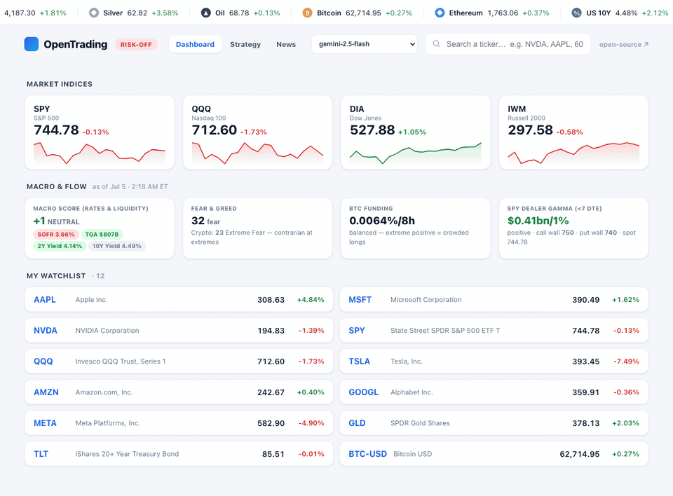
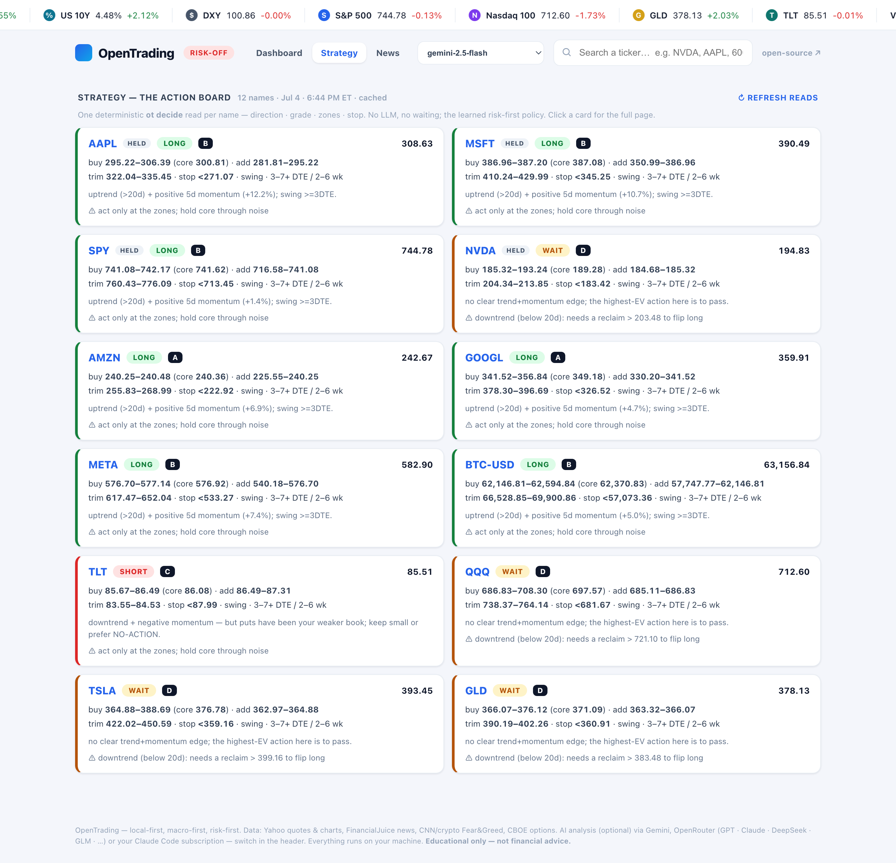

<div align="center">

<h1> OpenTrading</h1>

**本地优先的交易副驾 —— 宏观优先、风险优先、零 API key。**

[](LICENSE)
[](#环境要求)
[](#环境要求)
[](#环境要求)
[](#问-claude)

**[产品预览](#产品预览) · [第一性原理](#第一性原理) · [功能特性](#功能特性) · [快速开始](#快速开始) · [本地仪表盘](#ot-web-本地仪表盘) · [每日盘前邮件](#每日盘前邮件) · [隐私](#隐私)**

[English](README.md) | **简体中文**

</div>

OpenTrading 把 **宏观、新闻、聪明钱仓位与期权 gamma** 融合成一份有观点的市场解读，
再落成具体行动：评级后的 **做多 / 做空 / 观望** 行动面板、狙击点位，以及遵循一套
习得的风险优先策略的 **CALL / PUT / NO-ACTION** 决策引擎。一切都在你自己的电脑上运行：
没有 SaaS、没有 key、数据不出本机。把交易 *skill*（专业认知）与小巧零依赖的
*数据 CLI*（实时数据）配对，让 Claude 同时驱动两者。

> ⚠️ **仅供教育用途，非投资建议。交易涉及重大亏损风险。**

---

## 产品预览

<p align="center"></p>
<p align="center"><sub>约 12 秒的 <code>ot web</code> 之旅：宏观资金流仪表盘 → 策略行动面板 → 新闻 + 事件闸门 → 个股页（秒开的免 key K 线）→ 一键 AI 分析与狙击点位。</sub></p>

<table align="center"><tr>
<td align="center" width="50%"><br><sub><b>策略 —— 行动面板。</b>每个标的一张确定性的 <code>ot decide</code> 卡片：做多/做空/观望 · A–D 评级 · 建仓/加仓/止盈区 · 止损。无需 LLM，约 1 秒出全表。</sub></td>
<td align="center" width="50%"><br><sub><b>每日盘前邮件。</b>感知持仓、由 Claude 撰写、兼容 Outlook 的 HTML：市场状态判断、持仓关键位、评级 Top-3、对冲计划、事件闸门。</sub></td>
</tr></table>

<p align="center"><sub>所有演示均为虚构持仓 —— 你的真实持仓永远不会离开你的电脑。</sub></p>

---

## 第一性原理

整个系统按顺序强制执行的三条规则：

| # | 原理 | 在产品里意味着什么 |
|---|---|---|
| 1 | **宏观优先，形态其次，仓位第三。** | 每次解读都从利率/流动性 + 做市商 gamma + 情绪出发 —— 与大环境相逆的交易想法会被降级，无论图形多漂亮。 |
| 2 | **先风险，后机会。** | 没有失效位就没有点位：每份计划都带止损，仓位由止损距离 *推导* 而来；事件闸门（FOMC/CPI/OPEX/财报）可以直接否决加仓。**不动手也是一种持仓。** |
| 3 | **本地优先，免 key 优先。** | 公开无鉴权接口、Python 标准库、一切绑定 `127.0.0.1`。AI 层只是可选的点缀 —— 三个可互换引擎，其中一个就是你现有的 Claude 订阅，一个 key 都不用。 |

---

## 功能特性

| 模块 | 命令 | 作用 |
|------|------|------|
| **市场报告** | `ot` | 宏观 + 新闻 + 聪明钱 + 期权 + 你的持仓 → 一份市场状态解读 |
| **本地仪表盘** | `ot web` | 滚动行情带 · 指数 · 宏观资金流 · 策略面板 · 新闻+事件闸门 · 可切换引擎的个股 AI 分析 |
| **决策引擎** | `ot decide` | CALL / PUT / NO-ACTION + 信心 + 区间，来自习得的策略 |
| **每日邮件** | `ot email` / `ot schedule` | 感知持仓、兼容 Outlook 的 HTML 盘前简报（SMTP） |
| **新闻** | `ot news` | FinancialJuice 快讯（公开 RSS）—— 按时间窗/标的过滤、可存档 |
| **宏观** | `ot macro` | SOFR / 2s10s / TGA / RRP → 评分式多空偏向 |
| **聪明钱** | `ot smart` | CNN + 加密恐惧贪婪指数、BTC 资金费率（逆向） |
| **期权** | `ot options` | 看跌/看涨比 + 做市商 gamma（GEX）+ gamma 墙（CBOE） |
| **事件闸门** | `ot catalysts` / `ot earnings` | FOMC/CPI/PCE/NFP/OPEX + 个股财报 → 能否加仓的裁决 |
| **行情** | `ot quote` / `ot cn` | 免 key 行情，含盘前与 `^VIX`；A 股 / 港股 |
| **深度报告** | `ot report --deep` | 并行分析台 + 综合归纳（多智能体原型） |

任意工具加 `--json` 获得机器可读输出。完整帮助：`ot help`。

---

## 快速开始

**60 秒，零 key：**

```bash
git clone https://github.com/orangejustin/OpenTrading
cd OpenTrading
bash install.sh        # 把 `ot` 加入 PATH 并跑一次健康检查 —— 无需注册任何服务
ot                     # 早盘速览：宏观 + 新闻 + 聪明钱 + 期权 + 你的持仓
ot web                 # 仪表盘 → http://127.0.0.1:8787
```

> 不想改动 PATH？跳过 `install.sh`，直接原地运行：`bin/ot …`

**第一次用？** 从三个 [招牌工作流](WORKFLOWS.md) 开始 —— *早盘解读*、*现在能加仓吗？*、
*给我的持仓打分* —— 每个都只需一条命令加一句向 Claude 的提问。

### 问 Claude

用 **Claude Code**（或 Claude Desktop）打开这个文件夹，直接提问 —— 内置的
**short-term-trader** skill 会自动激活，并通过 `ot` 拉取实时数据：

- *"给我今早的宏观简报 —— 今天 QQQ 做 call 还是 put？"*
- *"过去一小时有没有 NVDA 的 FinancialJuice 新闻？存下来。"*
- *"NVDA 放量突破 $950，RSI 62，账户 $30k —— 这笔怎么交易？"*

skill 会在每一次回答中强制执行上面的 [第一性原理](#第一性原理)，其工作流覆盖宏观偏向、
新闻影响、交易形态、期权、加密仓位、交易日志、回测与组合复盘。

---

## AI 引擎 —— 自带你的 AI

数据面板永远免 key。可选的 AI 层跑在 **你选的引擎** 上，仪表盘顶部随时切换
（或 `ot web --engine … --model …`）：

| 引擎 | Key | 模型 |
|---|---|---|
| **Gemini** | `GEMINI_API_KEY`（免费额度即可） | gemini-2.5-flash / -pro |
| **OpenRouter** | `OPENROUTER_API_KEY` —— 一个 key，**任意**模型 | GLM 5.2 · DeepSeek v4 · GPT-5.5 · Claude · Grok · 任意 slug |
| **Claude Code** | **无需 key** —— 用你现有的订阅 | 无头 `claude -p`（default / sonnet / opus / haiku；每次运行都标注实际解析到的模型） |

每次分析都标注 `引擎 · 模型 · 耗时 · 完成时间（美东）`，缓存至你重新生成。
没配任何引擎？其余功能照常 —— 只是没有 AI 卡片。

---

## `ot web` 本地仪表盘

标准库 `http.server` + 原生 JS，无需构建，只绑定 `127.0.0.1`
（效果见 [产品预览](#产品预览)）：

```bash
ot web                                          # http://127.0.0.1:8787
ot web --engine claude                          # 用无需 key 的 Claude Code 引擎启动
ot web --engine openrouter --model z-ai/glm-5.2 # 用 GLM 5.2 启动
```

- **仪表盘** —— 滚动宏观行情带（点击直达 TradingView）· 指数卡片 · **宏观资金流**（宏观评分 · 恐惧贪婪 · BTC 资金费率 · SPY 做市商 gamma 与墙位）· 你的自选清单。
- **策略** —— 行动面板：每个标的一张确定性 `ot decide` 卡片（做多/做空/观望 · 评级 · 区间 · 止损），约 1 秒，无需 LLM。
- **新闻** —— 6 小时到 7 天时间窗（长窗口自动合并本地新闻存档）、即时关键词过滤、事件闸门条，以及 **🧠 AI 解读盘面**（偏向 · 驱动因素 · 组合倾斜）。
- **个股页** —— 秒开的免 key K 线图 + 关键指标 + 个股新闻（Yahoo RSS 兜底），**⚡ 按需一键 AI 分析**；支持 `/#NVDA` 深链；可选 TradingView 图表嵌入（默认关闭）。

详见 [`tools/web/README.md`](tools/web/README.md)。

---

## 每日盘前邮件

每个交易日早晨，一份 **感知持仓** 的盘前简报直达你的邮箱 —— 与 `ot` 同一套融合，
由 Claude 在你的订阅上撰写，以带样式、**兼容 Outlook 的 HTML** 投递：市场状态判断、
持仓关键位、评级后的 **Top-3 观察名单**（买入 / 等待到具体价格）、对冲计划与当日事件闸门。

```bash
cp .env.example .env       # 设置 OT_SMTP_* + OT_EMAIL_TO（Resend 无需 2FA 即可用）
ot email --dry-run         # 确认配置（不发送）
ot email                   # 单次发送   ·   --lang zh 输出简体中文
ot schedule email          # 工作日本地 08:30（macOS launchd）· `… email uninstall` 移除
```

> macOS：launchd 无法读取 `~/Desktop`、`~/Documents`、`~/Downloads` 下的仓库（TCC 限制）
> —— 请把仓库放在别处（如 `~/OpenTrading`）。详见 [`tools/email/README.md`](tools/email/README.md)。

---

## `ot decide` —— 一条命令的策略

`ot decide TICKER --dte N` 把成文的策略变成一个具体判断 ——
**CALL / PUT / NO-ACTION** + 信心 + 区间，全部来自免 key 数据：

```bash
ot decide QQQ  --dte 0     # 0DTE：填坑反打 + VIX 确认 + 避开事件 + 精选
ot decide NVDA --dte 5     # 波段：只在你读得懂的名字上做动量 call
```

它编码了 [`references/learned-strategy.md`](.claude/skills/short-term-trader/references/learned-strategy.md)
（选股 > 择时；硬性日亏损止损；亏损后绝不加码）。`ot web` 的策略面板就是这台引擎
在你整个持仓上的并行展开。

---

## 隐私

你的持仓与密钥 **绝不** 进入 git，也 **绝不** 出现在任何发布中：

| 内容 | 存放于 | 状态 |
|------|--------|------|
| 你的持仓 | `watchlist.json` | **git 忽略** —— 只有 `watchlist.example.json` 被跟踪 |
| 邮件 / API 凭据 | `.env` | **git 忽略** —— 只有 `.env.example` 被跟踪 |
| 抓取的新闻、报告、简报 | `data/` | **git 忽略** |

```bash
cp watchlist.example.json watchlist.json   # 然后填入你自己的持仓
cp .env.example .env                        # 然后填入你的 SMTP 凭据
```

`*.example` 只是占位模板，真实文件始终留在你本机。仪表盘只绑定 `127.0.0.1`。
**切勿提交 `.env` 或 `watchlist.json`。**

---

## 可选增强模块

以上核心是 **基础档**：免费、免 key、零手动步骤。以下模块能力更强，但都是 **可选**
的 —— 核心不依赖其中任何一个。

- **TradingView（已发布）** —— 通过 [`tradingview-mcp`](https://github.com/tradesdontlie/tradingview-mcp)
  把你的 TradingView 桌面端桥接给 Claude，直接问 *"用 TV 数据分析 MSTR"*。仪表盘个股页
  也提供可选的 TradingView 图表嵌入。*（ToS 灰色地带；仅对你自己已登录的客户端运行。）*
- **IBKR（计划中，`tools/ibkr/`）** —— 经 [`ib_async`](https://github.com/ib-api-reloaded/ib_async)
  接入盈透：行情、期权链，以及显式保护开关后的 **模拟盘** 执行。绝不自动提交实盘订单。

## 路线图

已发布历史见 [`RELEASE_NOTES.md`](RELEASE_NOTES.md)；完整细节见 [`ROADMAP.md`](ROADMAP.md)：

- **多引擎辩论。** Gemini 论多、GLM 论空、Claude 裁决 —— 五档结论 + 入场位 + 失效位，
  把 [TradingAgents](https://github.com/TauricResearch/TradingAgents) 的辩论协议精简为三次调用。
- **决策日志 v2。** 每个判断连同失效位入档；D1/D3 自动核对实现收益与超额，教训回灌到
  之后的每一次解读。
- **链上聪明钱。** `ot whales`：带标签的巨鲸钱包，经免 key 公共 RPC 轮询，按
  HIGH/MED/LOW 分级，汇入每日邮件的聪明钱板块。
- **仪表盘 v2。** 分析页图表已在 v3 落地 —— 下一步：板块聚合与个性化策略实验室。

---

## 环境要求

Python 3.9+（以标准库为主；装了 `certifi` 就用它做 TLS 校验，否则回退到系统 `curl`）。
无需任何 key、无需付费数据源。检测到 [`uv`](https://github.com/astral-sh/uv) 时 `ot`
自动优先使用，否则用普通 `python3` —— `OT_PYTHON` 覆盖解释器，`OT_NO_UV=1` 禁用 uv，
`ot doctor` 查看当前状态。

---

## 致谢与免责声明

由 [@orangejustin](https://github.com/orangejustin) 构建。多智能体方向借鉴
[TradingAgents](https://github.com/TauricResearch/TradingAgents)；部署与产品预览的打磨
借鉴 [daily_stock_analysis](https://github.com/ZhuLinsen/daily_stock_analysis)。

本项目提供的分析 **仅供教育用途**，**并非投资建议**。市场有风险，请据此控制仓位并
自行做尽职研究。
